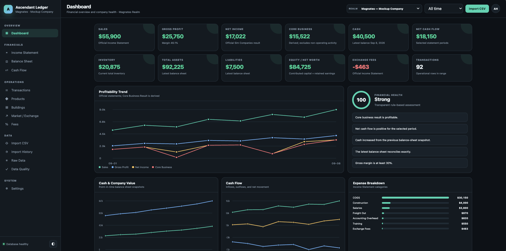
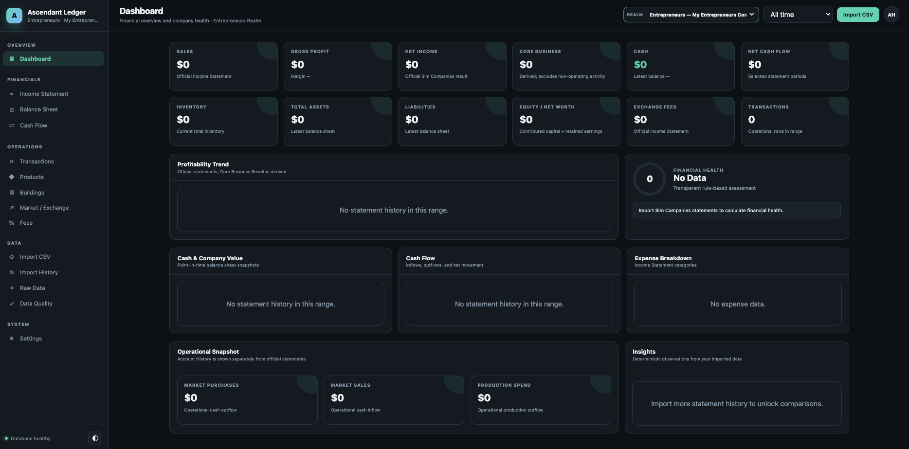
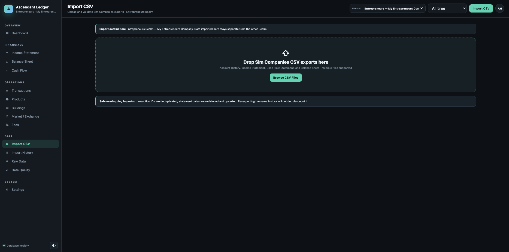

# Ascendant Ledger

This fork adds a live SimCompanies dashboard connected to the existing capture and
strategy service. See [Operations integration](docs/OPERATIONS_INTEGRATION.md) for
configuration, deployment, and data ownership. Original accounting features and
NullBot attribution are retained.

Ascendant Ledger is an **unofficial, self-hosted financial dashboard and accounting companion for Sim Companies**. It imports the CSV exports produced by the game and turns them into persistent dashboards, statements, transaction history, product/building analytics, market analysis, import history, and reconciliation checks.

It is designed for individual players who want a private, QuickBooks-style view of their Sim Companies businesses without sending their financial exports to a third-party service.

> Ascendant Ledger is an independent community project and is not affiliated with or endorsed by Sim Companies.

## Screenshots

### Financial Dashboard

Ascendant Ledger provides a clean financial overview with revenue, profit, cash flow, inventory, assets, liabilities, transaction activity, and financial health indicators.



### Dual-Realm Support

Magnates and Entrepreneurs are maintained as completely separate financial ledgers. Switch between Realms directly from the application header.



### CSV Import

Upload Sim Companies Account History, Income Statement, Cash Flow Statement, and Balance Sheet exports directly into the selected Realm.

Ascendant Ledger automatically detects the CSV type, validates the data, prevents duplicates, and keeps imports isolated between Realms.



## Version 1.1.0 — dual Realm support

Sim Companies allows a player to operate a separate business in each Realm. Ascendant Ledger now treats those businesses as independent ledgers:

- **Magnates**
- **Entrepreneurs**

Use the Realm selector in the top bar to switch between them. Dashboards, statements, transactions, imports, import history, rollback, data quality, analytics, and exports are scoped to the selected Realm.

Resource-ID and building-code mappings are intentionally shared because they describe game-wide identifiers rather than company finances.

### Fresh-install public release

This public package is privacy-scrubbed and intended for new community installations. It ships with two empty, generic businesses:

- `My Magnates Company`
- `My Entrepreneurs Company`

Rename either business from Settings after installation. No player CSV exports, database files, company names, counterparties, or real financial figures are included in the repository.

---

## Supported CSV exports

Ascendant Ledger currently recognizes these Sim Companies exports by their **column headers**, not their filenames:

- Account History
- Income Statement
- Cash Flow Statement
- Balance Sheet

Multiple files can be previewed and imported together. The preview displays new rows, updates, duplicates, invalid rows, date coverage, and schema warnings before anything is committed.

## Accounting model

The app deliberately separates two layers:

- **Official accounting totals:** Income Statement, Cash Flow Statement, Balance Sheet
- **Operational analytics:** Account History

Account History is not added on top of the financial statements, preventing activity represented in both exports from being counted twice.

Other important behaviors:

- Account History deduplicates using the Sim Companies transaction ID **within the selected Realm**.
- Statement rows are revisioned by Realm, statement type, and snapshot date.
- Re-importing overlapping exports does not duplicate history.
- Rolling back an import removes only the selected Realm's affected transaction ownership/revisions.
- Raw CSV rows and raw `Details` JSON are preserved for auditing and future parser improvements.
- SIM$ cash math uses integer values rather than floating-point currency arithmetic.
- **Core Business Result** is a derived metric and never replaces the game's official Net Income value.

---

## Features

### Dashboard

- Sales
- Gross profit and gross margin
- Official Net Income
- Derived Core Business Result
- Cash
- Net cash flow
- Inventory
- Assets
- Liabilities
- Equity / net worth
- Exchange fees
- Market purchases and sales
- Production spending
- Transaction count
- Profitability trend
- Cash/company value trend
- Cash-flow trend
- Expense breakdown
- deterministic financial-health status and insights

### Financial statements

Professional historical views for:

- Income Statement
- Balance Sheet
- Cash Flow Statement

### Transactions and operations

- searchable/paginated transaction ledger
- product analytics
- building analytics
- market/exchange analysis
- counterparties
- fee comparison by accounting source
- raw source JSON and import provenance

### Import management

- drag-and-drop CSV import
- schema detection
- preview before commit
- duplicate protection
- revision-aware statement updates
- import history
- batch details and SHA-256 provenance
- rollback
- malformed-row preservation

### Data quality

The app includes deterministic checks for accounting identities, balance-sheet reconciliation, statement bridges, cash-flow residuals, and Account History vs. statement timing.

### Settings

- separate business name for each Realm
- theme
- timezone
- currency symbol
- resource mappings
- building mappings
- optional single-user authentication
- full SQLite backup download

---

# Docker deployment

## Requirements

- Docker Engine 24+
- Docker Compose v2+
- Internet access during the first build so `npm ci` can download dependencies

## Install

```bash
git clone YOUR_REPOSITORY_URL
cd ascendant-ledger
cp .env.example .env
```

Edit `.env` for your environment. For LAN access:

```ini
BIND_ADDRESS=0.0.0.0
HOST_PORT=8080
```

Validate the deployment:

```bash
./preflight.sh
```

Start it:

```bash
docker compose up -d
```

Check status:

```bash
docker compose ps
docker compose logs --tail=100 ledger
```

Open:

```text
http://YOUR-SERVER-IP:8080
```

All persistent application data is stored in the configured Docker volume at `/data` inside the container.

---

# Upgrading future public releases

Before every upgrade, download a backup from Settings or back up the Docker volume. Then update the repository and rebuild:

```bash
git pull
docker compose down
docker compose up -d --build
```

Ascendant Ledger uses forward-only database migrations. Released migrations are immutable; future changes must be added as new migration files.

> If you are upgrading a private/pre-public 1.0 build of Ascendant Ledger, use the dedicated 1.1.0 upgrade package instead of this privacy-scrubbed fresh-install tree. The private upgrade package preserves the original migration checksums required by those databases.

---

# Authentication and remote access

Authentication is disabled by default for convenient local/LAN use.

If you expose the application outside your trusted LAN, enable authentication and place it behind HTTPS.

Example `.env` values:

```ini
AUTH_ENABLED=true
SESSION_SECRET=generate-a-long-random-secret
ADMIN_USERNAME=admin
ADMIN_PASSWORD=use-a-strong-password-at-least-12-characters
TRUST_PROXY=true
```

Generate a session secret with:

```bash
openssl rand -base64 48
```

Do not expose an unauthenticated installation directly to the public Internet.

---

# Backup and restore

A full database backup contains **both Realms**.

The application can create a safe SQLite online backup from Settings. The Docker persistent volume should also be included in your normal server/NAS backup routine.

To restore, stop the container before replacing the SQLite database unless you are using a SQLite-aware restore process.

---

# Development

The application intentionally uses a small stack:

```text
Browser HTML/CSS/JavaScript
        ↓ JSON API
Fastify + TypeScript / Node.js 22
        ↓
better-sqlite3 + Kysely
        ↓
SQLite
```

Development setup:

```bash
cd server
npm ci
npm run typecheck
npm test
npm run build
npm run dev
```

The production container serves both the API and frontend.

---

# Privacy

Ascendant Ledger has no required cloud backend and no built-in telemetry. Uploaded CSV contents and processed financial data remain in the local SQLite database for the installation you control.

Before publishing forks, screenshots, test fixtures, backups, or bug reports, review them for company names, transaction IDs, counterparties, and financial figures.

See `SECURITY.md` for security-reporting guidance.

# Creator and attribution

**Created by NullBot | Copyright 2026**

Ascendant Ledger was created by NullBot. Official builds display this attribution in the application footer. The copyright notice in `LICENSE` must be retained in copies or substantial portions of the software under the MIT License.

# License

MIT. See `LICENSE` and `NOTICE`.
